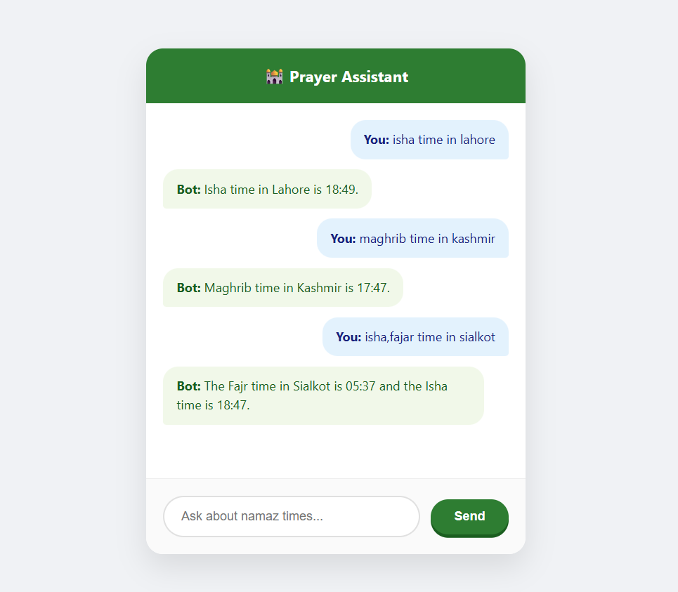

# 🕌 Pakistan Prayer Assistant (Agentic AI)

A specialized AI-powered prayer timing assistant designed for accuracy across all major cities in Pakistan. Unlike general LLMs which often provide outdated or estimated timings, this assistant uses **Tool-Calling (Agentic AI)** to retrieve real-time data directly from the Aladhan API.

---

## 🚀 Why This Project?
General AI models (like ChatGPT) suffer from "knowledge cutoff" and often fail to provide exact, real-time prayer timings because:
* **Dynamic Calculations:** Prayer times change daily based on the sun's position.
* **Localization:** General models may confuse methods (Hanafi vs Shafi'i) or specific city coordinates.
* **Reliability:** This project uses an **AI Agent loop**. Instead of guessing, the AI thinks: *"I need the exact time for Lahore,"* calls a verified tool, and then provides the answer.

---

## 🛠️ Features
* **Real-time Data:** Fetches live timings from the Aladhan API.
* **Specific Queries:** Ask for just one time (e.g., "When is Maghrib?") or the full schedule.
* **Natural Language:** Understands conversational Urdu/English inputs.
* **Tactile UI:** A modern, medium-sized chat interface with 3D button effects and smooth animations.

---

## 🖼️ Visual Overview

### User Interface :



## 💻 Installation & Setup

### 1. Clone the Repository
```bash
git clone (https://github.com/Zainch032/pakistan-prayer-bot.git)
cd pakistan-prayer-bot

```


### 2. Create a Virtual Environment (Recommended)

Creating a virtual environment ensures that the project dependencies do not conflict with other Python projects on your computer.

**For Windows:**

```bash
# Create the environment
python -m venv venv

# Activate the environment
venv\Scripts\activate

```

**For macOS/Linux:**

```bash
# Create the environment
python3 -m venv venv

# Activate the environment
source venv/bin/activate

```

### 3. Install Dependencies

```bash
pip install -r requirements.txt

```

*(Make sure your requirements.txt includes: flask, python-dotenv, requests, langchain-groq)*

### 4. Configuration

Create a `.env` file in the root directory and add your Groq API key:

```env
GROQ_API_KEY=your_api_key_here

```

### 5. Run the Application

```bash
python app.py

```

Open your browser and go to `http://127.0.0.1:5000`.

---

## 🧠 How It Works (The Agentic Loop)

The project utilizes a **Reasoning and Acting (ReAct)** pattern:

1. **User Query:** "What is the Fajr time in Karachi?"
2. **AI Reasoning:** The model identifies it needs specific data and calls the `get_daily_prayer_times` tool.
3. **Action:** The Python tool hits the Aladhan API.
4. **Observation:** The API returns a JSON of all timings.
5. **Final Output:** The AI filters the JSON to find "Fajr" and replies with a human-friendly sentence.

---


## 📜 License

Distributed under the MIT License. See `LICENSE` for more information.

